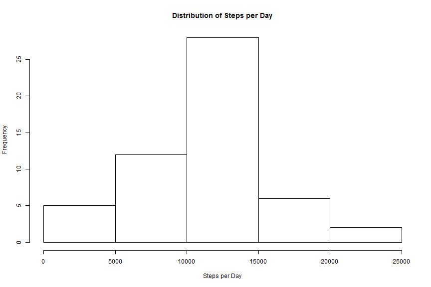
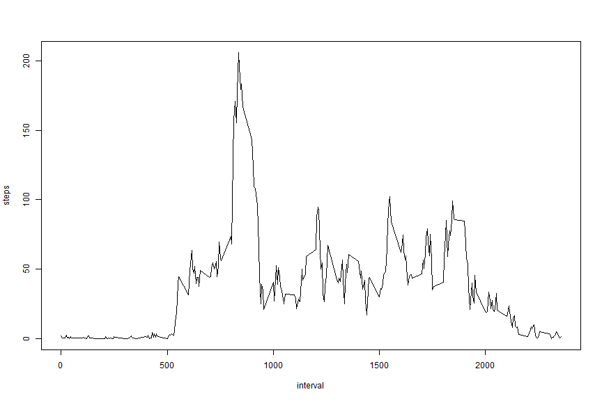
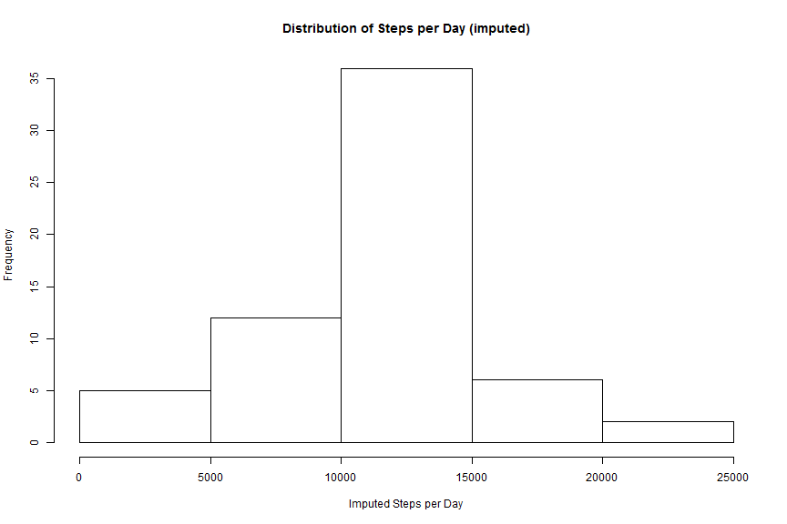
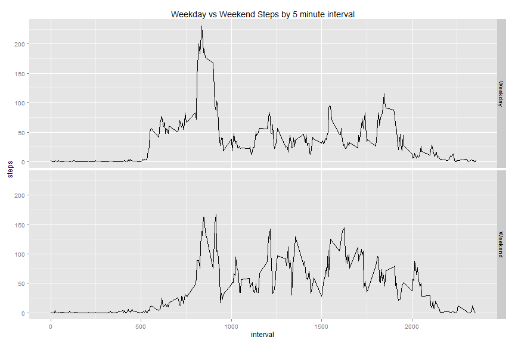

```r
knitr::opts_chunk$set(fig.width=12, fig.height=8, fig.path='figure/')
```
##Introduction
This documents the code and logic for the first Peer Assessment for the "Reproducible Research" course in the Coursera.org Data Science specialization. This procedure assumes that the code and the data it is being run against reside in the same working directory and that the following packages have already been downloaded and installed: 
* dplyr
* ggplot2

##Load and Pre-Process data
Before taking up any analysis, we need to 
1. Ensure any needed packages are loaded
2. Extract and load the data
3. Tidy-up the data and get it ready for analysis 
4. Disable scientific notation


```r
library(dplyr)
```

```
## 
## Attaching package: 'dplyr'
## 
## The following object is masked from 'package:stats':
## 
##     filter
## 
## The following objects are masked from 'package:base':
## 
##     intersect, setdiff, setequal, union
```

```r
library(ggplot2)
unzip("activity.zip")
activity <- read.csv("activity.csv")
activity[,2] <- as.Date(as.character(activity[,2]))
options(scipen=999)
```

##Identify the Mean Number of Steps Taken Each Day
For each day, summarize the number of steps taken each day, then calculate the mean and median steps taken each day. 

First, we need to group together all records by day and aggregate the results. 

```r
stepsPerDay <- aggregate(steps ~ date, data = activity, sum, na.action = na.pass)
print(stepsPerDay)
```

```
##          date steps
## 1  2012-10-01    NA
## 2  2012-10-02   126
## 3  2012-10-03 11352
## 4  2012-10-04 12116
## 5  2012-10-05 13294
## 6  2012-10-06 15420
## 7  2012-10-07 11015
## 8  2012-10-08    NA
## 9  2012-10-09 12811
## 10 2012-10-10  9900
## 11 2012-10-11 10304
## 12 2012-10-12 17382
## 13 2012-10-13 12426
## 14 2012-10-14 15098
## 15 2012-10-15 10139
## 16 2012-10-16 15084
## 17 2012-10-17 13452
## 18 2012-10-18 10056
## 19 2012-10-19 11829
## 20 2012-10-20 10395
## 21 2012-10-21  8821
## 22 2012-10-22 13460
## 23 2012-10-23  8918
## 24 2012-10-24  8355
## 25 2012-10-25  2492
## 26 2012-10-26  6778
## 27 2012-10-27 10119
## 28 2012-10-28 11458
## 29 2012-10-29  5018
## 30 2012-10-30  9819
## 31 2012-10-31 15414
## 32 2012-11-01    NA
## 33 2012-11-02 10600
## 34 2012-11-03 10571
## 35 2012-11-04    NA
## 36 2012-11-05 10439
## 37 2012-11-06  8334
## 38 2012-11-07 12883
## 39 2012-11-08  3219
## 40 2012-11-09    NA
## 41 2012-11-10    NA
## 42 2012-11-11 12608
## 43 2012-11-12 10765
## 44 2012-11-13  7336
## 45 2012-11-14    NA
## 46 2012-11-15    41
## 47 2012-11-16  5441
## 48 2012-11-17 14339
## 49 2012-11-18 15110
## 50 2012-11-19  8841
## 51 2012-11-20  4472
## 52 2012-11-21 12787
## 53 2012-11-22 20427
## 54 2012-11-23 21194
## 55 2012-11-24 14478
## 56 2012-11-25 11834
## 57 2012-11-26 11162
## 58 2012-11-27 13646
## 59 2012-11-28 10183
## 60 2012-11-29  7047
## 61 2012-11-30    NA
```
Second, we need to make a histogram of the steps/day. 

```r
hist(stepsPerDay$steps, main = "Distribution of Steps per Day", xlab = "Steps per Day")
```

 

Third, we need to calculate and report the mean and median of the total number of steps taken per day.  

```r
meanSteps <- mean(stepsPerDay$steps, na.rm=TRUE)
medianSteps <- median(stepsPerDay$steps, na.rm=TRUE)
```
The average steps per day is 10766.1886792. The median steps per day is 10765. 


##Identify the Average Daily Activity Pattern
Plot the average number of steps per daily 5 minute interval. 

```r
stepsPerInterval <- aggregate(steps ~ interval, data = activity, mean)
with(stepsPerInterval,
     plot(interval, steps, type = "l")
     )
```

 

Then, identify the single interval that has the highest average number of steps. 

```r
stepsPerInterval[which.max(stepsPerInterval[,2]),]
```

```
##     interval    steps
## 104      835 206.1698
```

##Impute Missing Values
First, calculate the total number of missing values.

```r
sum(is.na(activity$steps))
```

```
## [1] 2304
```
Second, impute data to those NA values. We will use the average of the given interval to impute NA values for that same interval. To do this, we first need to calculate the average per interval steps excluding NA values. We also need to give the results set meaningful column names. 

```r
intAve <- summarize(group_by(activity, interval), mean(steps, na.rm = TRUE))
colnames(intAve) <- c("interval", "average")
```
Then, we need to merge the activity data with the interval averages data, re-sort the results to match the activity data sorting and assign the averages for the given intervals to the date/interval conbinations that have "NA" as their value. 

```r
mergeSet <- subset(merge(activity, intAve, by.x="interval", by.y="interval"), is.na(steps))
mergeSet <- arrange(mergeSet, date, interval)
activity[which(is.na(activity$steps)),1] <- mergeSet$average
```
Finally, compare the mean and median of the results with imputed values to the mean and median taken at the beginning of this assignment. Use a histogram to show the new steps per day

```r
imputedStepsPerDay <- aggregate(steps ~ date, data = activity, sum)
hist(imputedStepsPerDay$steps, main = "Distribution of Steps per Day (imputed)", xlab = "Imputed Steps per Day")
```

 

Now find the mean and the median of the activity data with imputed values. 

```r
meanImputedSteps <- mean(imputedStepsPerDay$steps)
medianImputedSteps <- median(imputedStepsPerDay$steps)
```
Then compare the previous mean and median steps/day with the mean and median steps/day found using imputed values.
* The original mean steps/day is 10766.1886792 and the mean imputed steps/day is 10766.1886792. The difference is 0.
* The origina median steps/day is 10765 and the median imputed steps/day is 10766.1886792. The difference is -1.1886792. 

##Compare Weekdays to Weekends
This part of the analysis compares steps on weekends to steps on weekdays. To compare the two, we first need to add a factor variable to the activity data frame indicating if a day is a weekday or a weekend. 

```r
activity$day <- ifelse(weekdays(activity[,2]) == "Saturday"|weekdays(activity[,2]) == "Sunday", "Weekend","Weekday")
activity$day <- as.factor(activity$day)
```
Next, we want to plot the updated activity data to show average steps taken at each interval during weekdays and weekends. 

```r
aveStepsPerDay <- summarise(group_by(activity, day, interval), mean(steps))
colnames(aveStepsPerDay) <- c("day", "interval", "steps")
qplot(interval, steps, data = aveStepsPerDay, facets = day~., geom = "line", main = "Weekday vs Weekend Steps by 5 minute interval")
```

 


